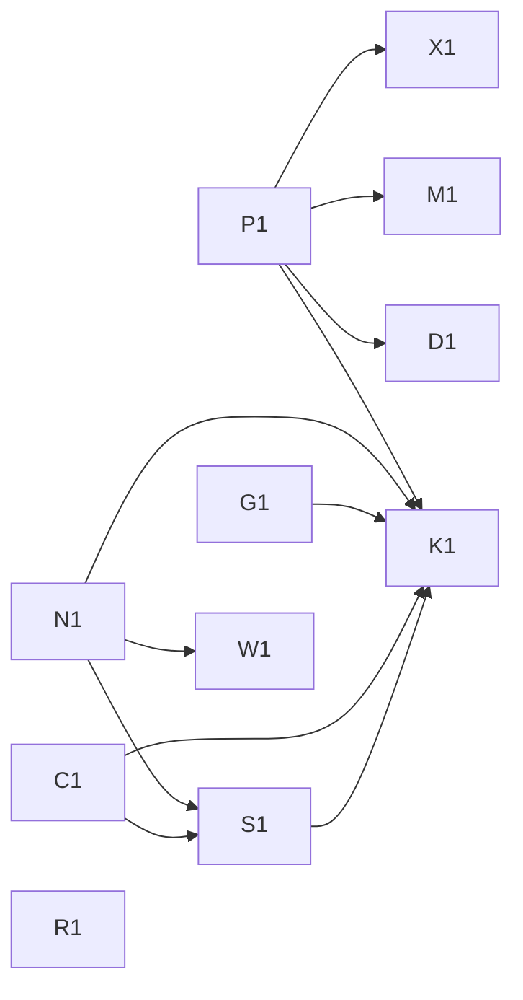

## Phase table

### Phase 1: must-sync before DSH is the primary harness

- [x] **P1** Retire plan-issue skills and tier codes; adopt named work modes: #308 (PR #318)
- [x] **N1** Adopt nils-cli 1.31.3+ for finish-line and mailbox fixes: #307 (PR #319)
- [x] **G1** Port agent-runtime-kit read-only guard fixes to DSH policy: #309 (PR #324)
- [x] **C1** Package home-scoped delivery and task policies for DSH sessions: #310 (PR #320)
- [ ] **S1** Bring session board, mailbox checkpoints, peer replies to DSH: #311 · after N1, C1
- [ ] **K1** Re-baseline agent-runtime-kit alignment and detect future drift: #312 · after P1, N1, G1, C1, S1

### Phase 2: should-sync

- [ ] **R1** Retire the three reminder rules agent-runtime-kit removed: #313
- [ ] **W1** Check DSH workers for coordination-guard PR-head and orphan defects: #314 · after N1
- [ ] **D1** Delegate deliver-pr review recovery to forge-cli: #315 · after P1
- [ ] **M1** Add outcome routing and program waves to DSH Main Agent Mode: #316 · after P1
- [ ] **X1** Retire heuristic-inbox and stale skill content: #317 · after P1

## Dependency graph

