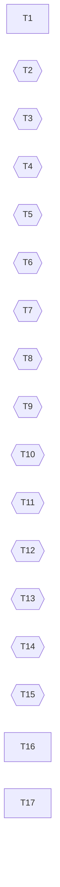

## Phase table

### Phase 1: runner family
- [x] **T1** repo-scoped private CI runner family (shared template, declarations, start-hook allowlist, capacity gate): #1073 (PR #1103)

### Phase 2: Linux-only repositories, highest volume first
- [x] **T2** example-org/agent-capabilities: #1080; depends on T1 (PR example-org/agent-capabilities#78)
- [x] **T3** example-org/m4-infra: #1076; depends on T1 (PR example-org/m4-infra#28)
- [x] **T4** example-org/serenvia-shell: #1078; depends on T1 (PR example-org/serenvia-shell#136)
- [x] **T5** example-org/c8-infra: #1077; depends on T1 (PR example-org/c8-infra#46)
- [x] **T6** example-org/fleet-infra: #1079; depends on T1 (PR example-org/fleet-infra#48)
- [ ] **T7** example-org/dsh-bots release: #1081; depends on T1 (admission #1115 deployed, workflow example-org/dsh-bots#66 merged; awaiting the first `v*` tag run)
- [x] **T8** sympoies/dsh-workbench-acceptance: #1083; depends on T1 (PR sympoies/dsh-workbench-acceptance#9)
- [ ] **T9** example-org/dsh-notify Linux CI and release: #1084; depends on T1 (Linux CI done; release admission #1115 deployed, workflow example-org/dsh-notify#16 merged; awaiting the first `v*` tag run)
- [x] **T10** example-org/m5u-infra: #1085; depends on T1 (PR example-org/m5u-infra#3)
- [x] **T11** example-org/dsh-workbench `ci.yml`: #1086; depends on T1 (PR example-org/dsh-workbench#32; Docker plane)

### Phase 3: Docker-capable jobs
- [x] **T12** egress enforced outside the container, then the Docker-capable variant: #1074; depends on T1 (PR #1117)
- [x] **T13** example-org/agent-runtime-personal: #1082; depends on T12 (PR example-org/agent-runtime-personal#18)
- [x] **T14** example-org/foraver: #1087; depends on T12 (PR example-org/foraver#20)
- [x] **T15** example-org/dsh-workbench `publish-image.yml`: #1086; depends on T12 (PR example-org/dsh-workbench#32)

### Phase 4: macOS and follow-ups
- [x] **T16** macOS decision (user, via laoda): #1075 (PR example-org/dsh-notify#15)
- [x] **T17** Actions hygiene follow-ups: #1088 (workflow hygiene in 7 PRs plus example-org/agent-console#650; remaining items are watch-only)

## Dependency graph

- T1 -> T2, T3, T4, T5, T6, T7, T8, T9, T10, T11
- T1 -> T12 -> T13, T14, T15
- T16 is independent; the dsh-notify macOS leg (T9) follows its outcome.
- T17 is independent.
